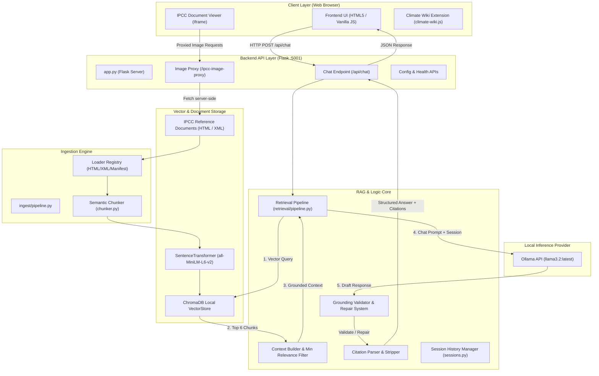
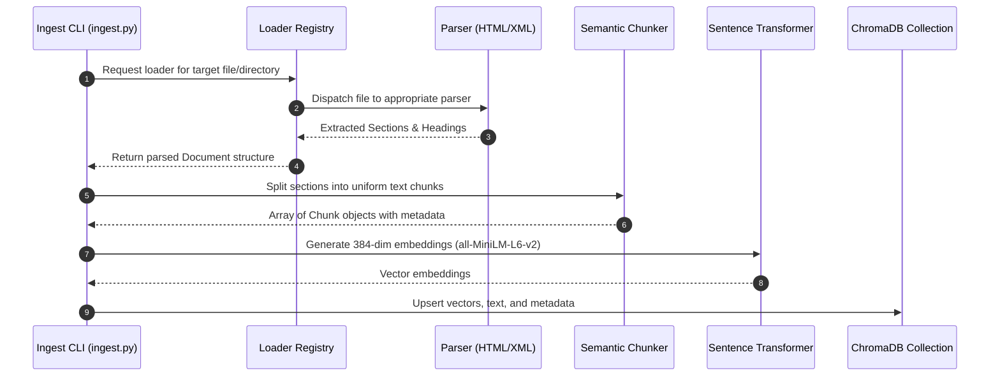
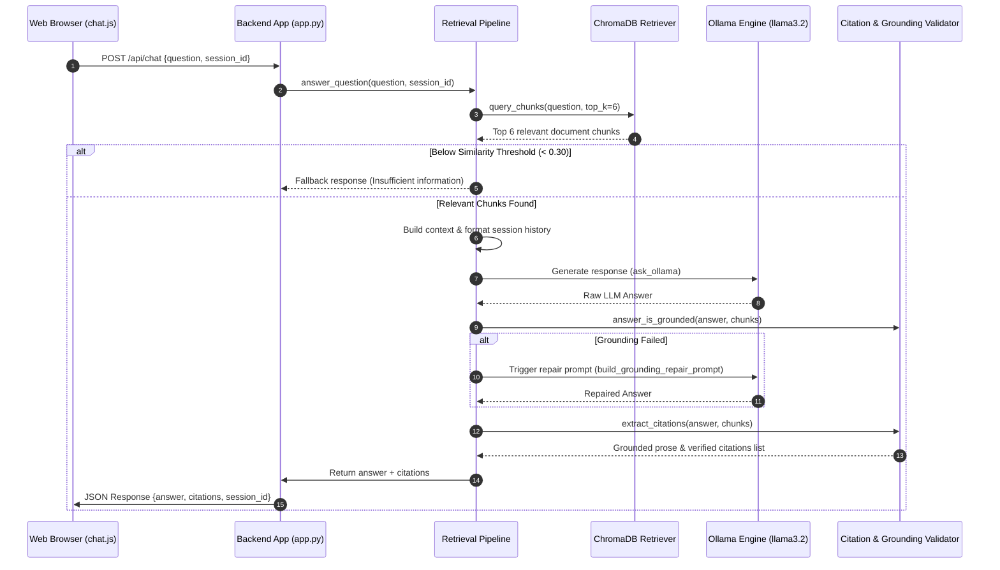

# 🗺️ ClimateInsight — Comprehensive Project Map

ClimateInsight is an AI-powered, privacy-first chatbot platform designed to make the **Intergovernmental Panel on Climate Change (IPCC)** AR6 Synthesis Report accessible through natural language. Built around a **Retrieval-Augmented Generation (RAG)** pipeline, it pairs a local vector database (**ChromaDB**), sentence embedding model (`all-MiniLM-L6-v2`), and local Large Language Model (**Ollama `llama3.2`**) with a Flask REST API and responsive frontend UI.

---

## 🏗️ High-Level System Architecture



---

## 📂 Directory & File Hierarchy Map

Below is the directory map of the ClimateInsight codebase:

```text
ClimateInsight/
├── 📄 README.md                        # Setup, configuration, and developer guide
├── 📄 config.toml                      # Project metadata & standard configuration
├── 📄 requirements.txt                 # Python backend dependencies
├── 📁 backend/                         # Flask Backend & RAG System Core
│   ├── 📄 app.py                       # Flask server entry point & HTTP endpoints
│   ├── 📄 config.py                    # Backend configuration settings
│   ├── 📄 db.py                        # Database utility hooks
│   ├── 📄 llm.py                       # High-level LLM helper interface
│   ├── 📄 sessions.py                  # In-memory session history manager
│   ├── 📁 chroma_db/                   # Persistent local ChromaDB storage
│   ├── 📁 ingest/                      # Ingestion pipeline & loaders
│   │   ├── 📄 __init__.py
│   │   ├── 📄 chunker.py               # Document text chunker with overlap
│   │   ├── 📄 ingest.py                # Ingestion CLI entry point
│   │   ├── 📄 loader_registry.py       # Multi-format document loader discovery
│   │   ├── 📄 models.py                # Data classes (Chunk, Section, Document)
│   │   ├── 📄 parser.py                # Standard HTML reference document parser
│   │   ├── 📄 pipeline.py              # Ingestion execution controller
│   │   ├── 📄 xml_parser.py            # XML / JATS document parser
│   │   └── 📁 manifest_ingest/         # Semantic corpus manifest loader
│   ├── 📁 retrieval/                   # Retrieval-Augmented Generation core
│   │   ├── 📄 __init__.py
│   │   ├── 📄 citation_parser.py       # Source verification & citation extractor
│   │   ├── 📄 context_builder.py       # Relevance filtering & context assembly
│   │   ├── 📄 pipeline.py              # End-to-end RAG answer execution pipeline
│   │   └── 📄 prompt_builder.py        # Grounding & Chat prompt templates
│   ├── 📁 services/                    # Flask service layer & response formatters
│   │   ├── 📄 __init__.py
│   │   ├── 📄 chat_service.py          # Chat request processing wrapper
│   │   ├── 📄 greeting_service.py      # Automated greeting generator
│   │   ├── 📄 response_formatter.py    # Standardized API JSON responses
│   │   └── 📄 session_service.py       # Session lifecycle management
│   ├── 📁 vectorstore/                 # ChromaDB client & embeddings layer
│   │   ├── 📄 __init__.py
│   │   ├── 📄 chroma_client.py         # Client initializer for ChromaDB
│   │   ├── 📄 embedder.py              # SentenceTransformers embedding client
│   │   ├── 📄 indexer.py               # Vector indexing & chunk upserts
│   │   └── 📄 retriever.py             # Vector similarity query engine
│   ├── 📁 llm/                         # Ollama LLM integration modules
│   │   ├── 📄 __init__.py
│   │   ├── 📄 client.py                # HTTP client for local Ollama server
│   │   ├── 📄 prompt_templates.py      # LLM prompt templates & repair prompts
│   │   └── 📄 translation.py           # Multi-language translation layer
│   └── 📁 tests/                       # Backend unit and integration test suite
│       ├── 📄 conftest.py
│       ├── 📄 test_citation_scoping.py
│       ├── 📄 test_manifest_build.py
│       ├── 📄 test_manifest_jats.py
│       ├── 📄 test_manifest_load.py
│       ├── 📄 test_manifest_text_loader.py
│       ├── 📄 test_prompt_quality.py
│       ├── 📄 test_retrieval_threshold.py
│       └── 📄 test_retriever_citation_ids.py
├── 📁 frontend/                        # Web Application UI (HTML/CSS/JS)
│   ├── 📄 index.html                   # Main chat interface layout & modal views
│   ├── 📄 ipcc_logo.png                # IPCC branding assets
│   ├── 📄 tunnel-base.txt              # Cloudflare tunnel base URL cache
│   ├── 📁 css/                         # Application stylesheets
│   │   ├── 📄 style.css                # Core design system & layout styles
│   │   ├── 📄 report.css               # IPCC embedded document styling
│   │   └── 📄 tour.css                 # Guided tour modal styles
│   ├── 📁 js/                          # Modular JavaScript modules
│   │   ├── 📄 about.js                 # About modal logic & metadata render
│   │   ├── 📄 api.js                   # Fetch API wrapper for backend endpoints
│   │   ├── 📄 chat.js                  # Chat UI logic, message rendering & citations
│   │   ├── 📄 config.js                # Default frontend runtime settings
│   │   ├── 📄 main.js                  # Application initialization & event wiring
│   │   ├── 📄 runtime-config.js        # Dynamic API base URL injector
│   │   ├── 📄 sidebar.js               # History sidebar & session switching
│   │   └── 📄 tour.js                  # Interactive user onboarding tour
│   └── 📁 tests/                       # Frontend test suite
│       └── 📄 api-base.test.js
├── 📁 encyclopedia/                    # External knowledge base modules
│   └── 📄 climate-wiki.js              # Climate terms dictionary & tooltip injection
├── 📁 data/                            # Raw data & assets
│   ├── 📄 extract_fig.py               # Figure extraction utility script
│   ├── 📁 raw/                         # Raw IPCC HTML & XML source files
│   │   └── 📄 ipcc_reference.html      # IPCC AR6 reference document
│   └── 📁 images/                      # Extracted report figures & graphics
├── 📁 docs/                            # Project documentation & presentations
│   ├── 📄 ClimateInsight_Chatbot.pptx  # Project presentation deck
│   └── 📄 manifest_adapter_outline.md  # Architectural outline for manifest format
└── 📁 scripts/                         # DevOps & Tunnel scripts
    └── 📄 inject-tunnel.py             # Cloudflare Quick Tunnel utility script
```

---

## 🔄 Core Data Pipelines

### 1. Document Ingestion Pipeline



### 2. Retrieval-Augmented Generation (RAG) Query Pipeline



---

## 📑 Detailed Module Breakdown

### 🎯 Backend Services & API Layer
- **[app.py](file:///Users/anusha/Desktop/ClimateInsight/backend/app.py)**: Serves API endpoints (`/api/chat`, `/api/health`, `/api/config`, `/api/session/<id>`), proxy endpoints (`/ipcc-image-proxy`), and reference document delivery (`/ipcc-reference`).
- **[sessions.py](file:///Users/anusha/Desktop/ClimateInsight/backend/sessions.py)**: In-memory store maintaining conversation history per `session_id`.
- **[services/response_formatter.py](file:///Users/anusha/Desktop/ClimateInsight/backend/services/response_formatter.py)**: Formats standard API JSON outputs.

### 🧠 RAG & Retrieval Engine
- **[retrieval/pipeline.py](file:///Users/anusha/Desktop/ClimateInsight/backend/retrieval/pipeline.py)**: Orchestrates the search, prompting, LLM invocation, fallback, and citation parsing workflow.
- **[retrieval/context_builder.py](file:///Users/anusha/Desktop/ClimateInsight/backend/retrieval/context_builder.py)**: Prepares prompt context blocks and enforces minimum relevance scores (`MIN_RELEVANCE_SCORE`).
- **[retrieval/citation_parser.py](file:///Users/anusha/Desktop/ClimateInsight/backend/retrieval/citation_parser.py)**: Validates that answers are grounded in reference material and extracts clickable metadata citations.
- **[retrieval/prompt_builder.py](file:///Users/anusha/Desktop/ClimateInsight/backend/retrieval/prompt_builder.py)**: Constructs strict system prompts instructing the model to remain anchored in source material.

### 📦 Vector Store & Embeddings
- **[vectorstore/chroma_client.py](file:///Users/anusha/Desktop/ClimateInsight/backend/vectorstore/chroma_client.py)**: Initializes persistent local ChromaDB instance.
- **[vectorstore/embedder.py](file:///Users/anusha/Desktop/ClimateInsight/backend/vectorstore/embedder.py)**: Wraps `SentenceTransformer` to generate 384-dimensional vector embeddings.
- **[vectorstore/retriever.py](file:///Users/anusha/Desktop/ClimateInsight/backend/vectorstore/retriever.py)**: Queries ChromaDB by cosine distance.

### 📥 Data Ingestion Subsystem
- **[ingest/ingest.py](file:///Users/anusha/Desktop/ClimateInsight/backend/ingest/ingest.py)**: Main ingestion CLI script supporting file, directory, and manifest ingestion modes.
- **[ingest/loader_registry.py](file:///Users/anusha/Desktop/ClimateInsight/backend/ingest/loader_registry.py)**: Dynamic file loader discovery registry for `.html`, `.xml`, and manifest files.
- **[ingest/chunker.py](file:///Users/anusha/Desktop/ClimateInsight/backend/ingest/chunker.py)**: Chunks text with section boundaries and configured chunk overlap.

### 💻 User Interface (Frontend)
- **[frontend/index.html](file:///Users/anusha/Desktop/ClimateInsight/frontend/index.html)**: Clean HTML5 layout with split-pane view for chat and IPCC document viewer.
- **[frontend/js/chat.js](file:///Users/anusha/Desktop/ClimateInsight/frontend/js/chat.js)**: Handles chat rendering, streaming/typing animations, citation badge creation, and document jumping.
- **[frontend/js/api.js](file:///Users/anusha/Desktop/ClimateInsight/frontend/js/api.js)**: Central HTTP client interacting with `/api/chat` and `/api/config`.
- **[frontend/js/runtime-config.js](file:///Users/anusha/Desktop/ClimateInsight/frontend/js/runtime-config.js)**: Allows dynamic backend API target specification for local vs. Cloudflare tunnel environments.

### 🛠️ Developer & DevOps Tools
- **[scripts/inject-tunnel.py](file:///Users/anusha/Desktop/ClimateInsight/scripts/inject-tunnel.py)**: Automates Cloudflare Quick Tunnel creation for exposing frontend and backend during external development without manual URL edits.

---

## 🛠️ Technology Stack

| Category | Technology | Usage in ClimateInsight |
| :--- | :--- | :--- |
| **Backend API** | Python 3.10+, Flask, Flask-CORS | API Endpoints & Image Proxying |
| **LLM Provider** | Ollama (`llama3.2:latest`) | Local Zero-Data-Leakage Inference |
| **Vector DB** | ChromaDB | Local Vector Embeddings Indexing |
| **Embeddings** | HuggingFace `all-MiniLM-L6-v2` | 384-dimensional text embeddings |
| **RAG Pipeline** | Custom Python Core & LangChain helpers | Grounding, repair loops, & citations |
| **Frontend** | HTML5, Vanilla JavaScript, CSS3 | Zero-build fast web dashboard |
| **DevOps / Tunnels** | Cloudflared Quick Tunnels | Dynamic environment sharing |
| **Testing** | Pytest | Vectorstore & RAG Pipeline unit tests |

---

## 🚀 Quick Reference Commands

### 1. Ingestion Pipeline
```bash
cd backend
python3 -m ingest.ingest
```

### 2. Run Backend (Localhost:5001)
```bash
cd backend
python3 app.py
```

### 3. Run Frontend (Localhost:3000)
```bash
cd frontend
python3 -m http.server 3000
```

### 4. Cloudflare External Tunnel Mode
```bash
python3 scripts/inject-tunnel.py
```

### 5. Run Unit Tests
```bash
pytest backend/tests/
```
